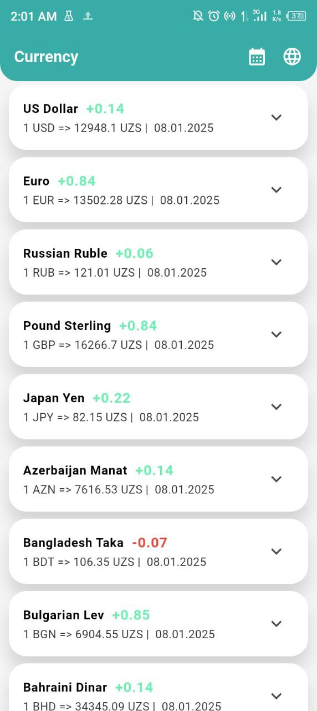
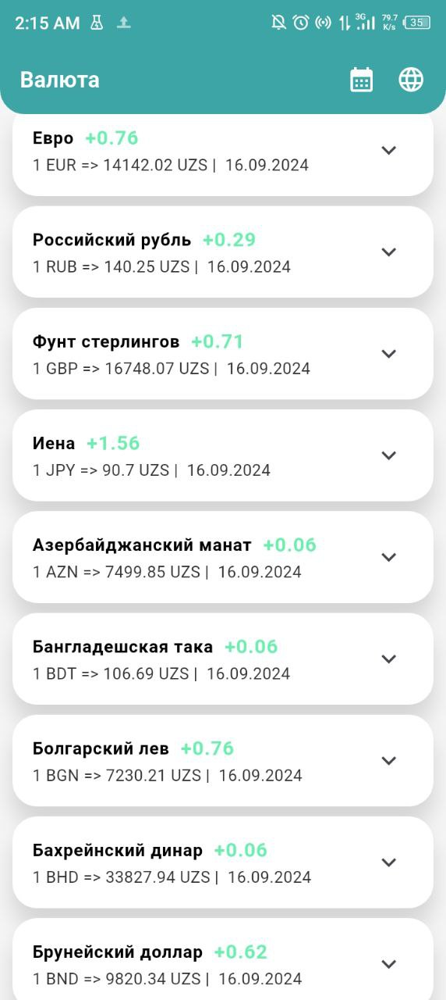
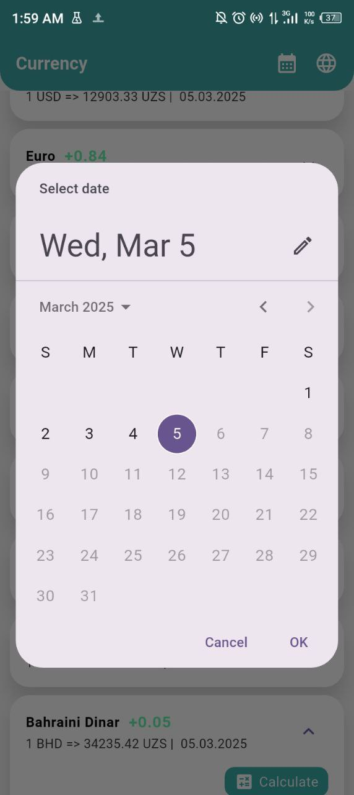
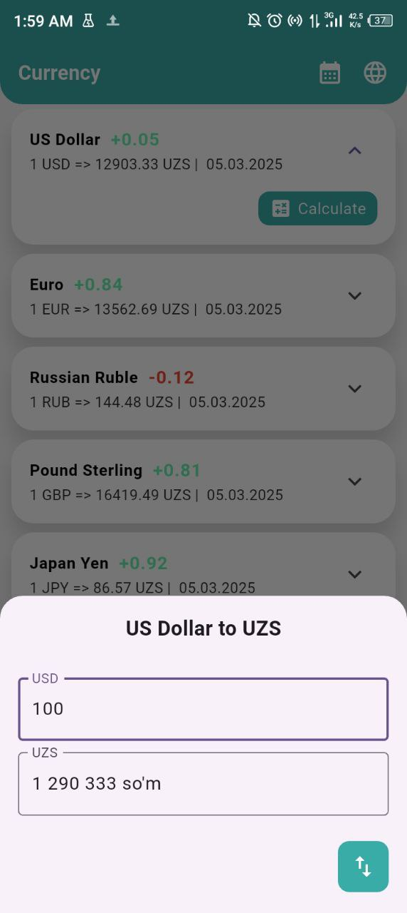
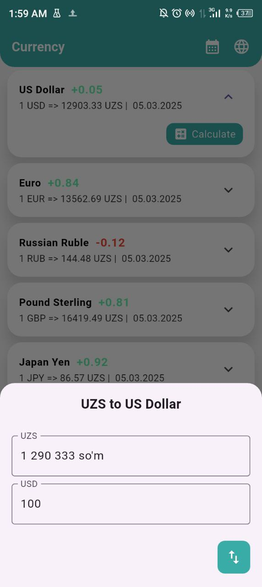
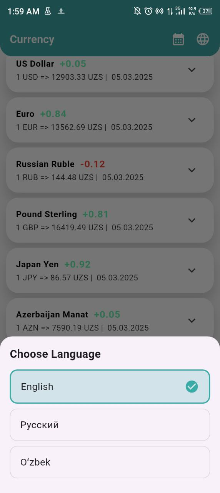

### 💱 Currency Converter App (Flutter)
Welcome to the Currency Converter app! This app provides real-time and historical exchange rates
from the Uzbek bank's API, allowing users to calculate currency conversions with ease. With a simple
and intuitive interface, users can switch between languages, select a specific date for exchange
rates, and convert money based on their chosen currency.

---

### 📱 App Overview
The Currency Converter app helps users stay updated with the latest exchange rates and retrieve past
rates for any given date. The app fetches real-time and historical data from the Uzbek bank's API,
ensuring smooth performance with efficient state management. Users can switch languages for a more
personalized experience and calculate money conversions instantly.

---

### ⚙️ Technologies Used
- **Flutter**: Cross-platform development for Android and iOS.
- **Retrofit & Dio**: Efficient API handling for fetching live and historical exchange rates.
- **State Management**: Ensures smooth and predictable UI updates.
- **Hive**: Saves changed language.
- **Localization**: Allows users to switch between different languages.
- **Date-Based Currency Rates**: Fetches exchange rates for a selected date.
- **Real-Time Calculation**: Instantly converts money based on the chosen currency.

### 🖼️ Screenshots

<table>
  <tr>
    <td></td>
    <td></td>
    <td></td>
  </tr>
  <tr>
    <td></td>
    <td></td>
    <td></td>
  </tr>
</table>